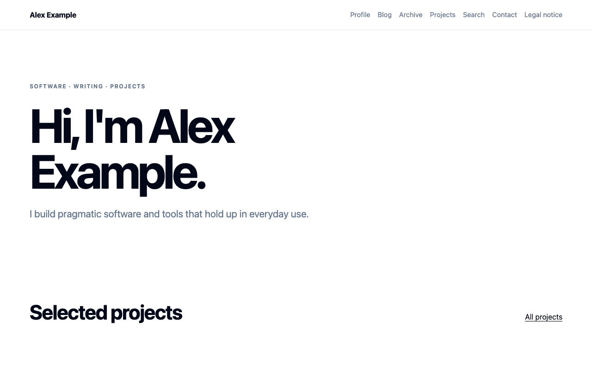

# Contentkit

[](https://github.com/MikeBild/contentkit/actions/workflows/ci.yml)
[](https://github.com/MikeBild/contentkit/releases)
[](LICENSE)

**Markdown in, multilingual static website out.** Contentkit is an API-first
mini-CMS for portfolios, blogs, product documentation, wikis, knowledge bases,
product pages, changelogs and visual reports: you upload Markdown through an HTTP API,
Contentkit renders it into an immutable static-site release and activates it
atomically — with instant, pointer-based rollback.

It is deliberately not a WYSIWYG CMS: there is no admin UI, no page builder
and no plugin system. Content lives as portable Markdown, the API is the
contract ([OpenAPI 3.1](docs/openapi.json)), and production is a single
self-contained binary. Contentkit powers personal sites in production.



## Quickstart

Requirements: Node 20.12+ and Docker Desktop.

```bash
git clone https://github.com/MikeBild/contentkit.git
cd contentkit
npm install
npm start
```

`npm start` boots a zero-config local stack (PostgreSQL 16 in Docker plus a
local storage/webhook boundary), prints the API URL and a development admin
key, and opens `http://127.0.0.1:4050`. Then publish a complete demo site —
profile page, blog post and legal notice:

```bash
npm run demo:profile
```

That produces the site shown above — profile page, blog post and legal
notice, rendered as a complete static release.

Local state lives in the Docker volume `contentkit-local-postgres` and
`.contentkit-local/`; reset everything with `npm run local:reset`.

## Features

- Pages, posts and projects with immutable draft revisions.
- Controlled site presets for portfolios, versioned product documentation,
  wikis, knowledge bases, product landing pages and changelogs, plus a
  per-document layout override.
- Hierarchical documentation navigation, breadcrumbs, heading tables of
  contents and current/archived product versions.
- Release-scoped reader access control for individual pages, path areas and
  media, with personal usernames, salted scrypt passwords, groups and revocable
  sessions. Protected content is excluded from public discovery outputs.
- GFM, footnotes, safe directives, KaTeX, Mermaid and Shiki highlighting.
- Responsive reports and dashboards from Markdown: shadcn-style metric cards,
  status badges and progress, plus table-driven bar, line, area and donut charts
  rendered server-side as accessible light/dark SVGs with no client chart runtime.
- Locale-prefixed routes, translation alternates, a year-grouped archive with
  client-side tag filtering, a tag index and tag pages.
- Reading time, related posts by tag similarity, older/newer navigation and a
  staleness notice on posts older than three years.
- RSS, per-tag feeds, sitemap, robots, canonical metadata, OpenGraph and JSON-LD.
- Read-aloud audio: pre-rendered TTS narration per post with a custom player,
  download link, blogcast feed, a per-locale blogcast page at
  `/{locale}/blogcast/`, budgets and automatic rebuilds.
- A per-site `llms.txt` and `llms-full.txt` for AI agents, per locale.
- Expiring preview links and pointer-based instant rollback.
- Scoped API keys, moderated guest comments and contact submissions.
- Cloudflare Turnstile, honeypot and rate limits on public writes.
- Signed Standard Webhooks notifications for contact, comment and release events.
- One self-contained Linux binary and hardened systemd deployment.
- Content lifecycle webhook events (`content.published`, `content.unpublished`,
  `release.published`) emitted transactionally on release activation.
- Content modeling light: author-owned `extra:` custom fields and `related:`
  post references in frontmatter — no schema builder; page rendering of the
  extra fields is a per-site opt-in via `settings.content.show_extra`.
- Optional headless JSON read API: list and fetch published content (metadata
  verbatim, Markdown source, on-demand rendered HTML, ETag/304 caching) via
  scoped `content:read` keys — site delivery itself stays static.
- Server-side full-text search over published content with locale-aware
  PostgreSQL stemming (de/en), relevance ranking and `<mark>` headlines via
  `GET /v1/sites/{site}/search` — published sites keep their client-side search.
- Bounded site-scoped product analytics for releases, content, reader auth,
  webhooks, audio and engagement through `/v1/sites/{site}/stats/*`, reusing
  `content:read` keys and returning aggregate counts only. See
  [docs/PRODUCT_ANALYTICS.md](docs/PRODUCT_ANALYTICS.md).
- Per-site theming as structured design tokens: `settings.theme.tokens` fills
  the shared stylesheet's custom properties (allowlisted, light/dark aware,
  including `chart_1` through `chart_5`; `settings.accent` stays the primary
  shorthand) and a size-capped
  `settings.theme.custom_css` escape hatch — no template overrides.

## How it works

Every content upload creates an immutable revision in PostgreSQL. A release
renders selected revisions into a complete static site (HTML, RSS, sitemap,
search index, hashed assets) and uploads it to a private storage bucket under
a new immutable prefix. Activation atomically moves the site's release
pointer; rollback moves it back. Serving is a thin gateway that maps custom
domains to the active release. See
[docs/ARCHITECTURE.md](docs/ARCHITECTURE.md) for the full model.

The application applies the SQL bundle embedded in this exact build under a
PostgreSQL advisory lock before opening HTTP. A migration or storage failure
aborts startup. To migrate without starting HTTP, run
`node server.mjs --migrate` (or `NODE_ENV=production dist/contentkit --migrate`).

## Create content

For production, use two scoped keys instead of the bootstrap key:

```bash
export CONTENTKIT_URL="https://contentkit-api.example.com"
export CONTENTKIT_SITE_ADMIN_KEY="ck_..."      # site:admin
export CONTENTKIT_PUBLISH_API_KEY="ck_..."     # content:read content:write release:write
```

`site:admin` can create/update sites and create more keys. It cannot publish
content unless the same key also has content/release scopes. A publishing key can
upload Markdown, build previews and publish releases, but cannot create sites.
Raw API keys are returned only once by `/v1/api-keys`. Send a key as
`Authorization: Bearer ck_...` or `X-API-Key: ck_...`. A rejected key returns
`401 {"error":"unauthorized"}` (missing/revoked/expired or wrong
`CONTENTKIT_KEY_PEPPER` — the key was not recognized), whereas a recognized key
without the needed scope returns `403 {"error":"insufficient_scope",...}`. See
[docs/llms-full.txt](docs/llms-full.txt) section 3 for the full auth model and
section 13 for webhook signature verification.

Create a site:

```bash
curl -X POST "$CONTENTKIT_URL/v1/sites" \
  -H "Authorization: Bearer $CONTENTKIT_SITE_ADMIN_KEY" \
  -H "Content-Type: application/json" \
  -d '{
    "name":"Example",
    "base_url":"https://example.com",
    "default_locale":"de",
    "locales":["de","en"],
    "domains":["example.com"],
    "settings":{"hero_title":"Hello","hero_text":"Personal website"}
  }'
```

Upload Markdown and referenced files:

```bash
curl -X POST "$CONTENTKIT_URL/v1/sites/<site-id>/content" \
  -H "Authorization: Bearer $CONTENTKIT_PUBLISH_API_KEY" \
  -F "document=@examples/post.de.md;type=text/markdown" \
  -F "asset:images/hero.jpg=@hero.jpg;type=image/jpeg"
```

Build a preview or release using the returned revision ID:

```bash
curl -X POST "$CONTENTKIT_URL/v1/sites/<site-id>/previews" \
  -H "Authorization: Bearer $CONTENTKIT_PUBLISH_API_KEY" \
  -H "Content-Type: application/json" \
  -d '{"revision_ids":["<revision-id>"],"expires_in":3600}'

curl -X POST "$CONTENTKIT_URL/v1/sites/<site-id>/releases" \
  -H "Authorization: Bearer $CONTENTKIT_PUBLISH_API_KEY" \
  -H "Content-Type: application/json" \
  -d '{"revision_ids":["<revision-id>"],"reason":"initial release"}'
```

The full live contract is available at `/openapi.json`. A committed canonical
snapshot lives in [docs/openapi.json](docs/openapi.json); update it with
`npm run docs:gen-openapi` whenever the HTTP API changes. LLM-friendly docs
are served at `/llms.txt` and `/llms-full.txt`.

## Site presets and page layouts

Choose a controlled preset through `settings.presentation.preset`; existing
sites default to `portfolio`. Templates remain Contentkit-owned and contain no
uploaded executable code.

```json
{
  "presentation": {
    "preset": "product-docs",
    "docs": {
      "versions": [
        { "id": "v2", "label": "2.x", "status": "current" },
        { "id": "v1", "label": "1.x", "status": "archived" }
      ]
    }
  }
}
```

A Markdown page can use the controlled layouts `standard`, `docs`, `wiki`,
`knowledge`, `landing`, `changelog` or `report`. Documentation hierarchy uses `docKey`,
`docsVersion`, `parent`, `navTitle` and `navOrder`. See
[docs/TEMPLATES.md](docs/TEMPLATES.md) for routes, complete frontmatter and the
real example documents in `examples/docs`, `examples/wiki`,
`examples/knowledge`, `examples/landing`, `examples/changelog` and
`examples/reports`. The focused [report guide](docs/REPORTS.md) documents every
dashboard primitive, chart option, theme token and resource limit.

## Protect reader content

Reader accounts are separate from management API keys. A site administrator
creates groups and personal users, then either adds `access: [customers]` to a
Markdown document or creates an exact/prefix path rule. The next release
snapshots the content and policy together, so rollback restores both.

```bash
curl -X POST "$CONTENTKIT_URL/v1/sites/$SITE/access/groups" \
  -H "Authorization: Bearer $CONTENTKIT_SITE_ADMIN_KEY" \
  -H "Content-Type: application/json" \
  -d '{"slug":"customers","name":"Customers"}'

curl -X POST "$CONTENTKIT_URL/v1/sites/$SITE/access/users" \
  -H "Authorization: Bearer $CONTENTKIT_SITE_ADMIN_KEY" \
  -H "Content-Type: application/json" \
  -d '{"username":"anna","display_name":"Anna","password":"a-long-unique-password","groups":["customers"]}'
```

Opening a protected page redirects an anonymous visitor to the site login.
After sign-in, an HttpOnly session cookie grants only the user's groups or
personal rules. Protected documents are absent from public sitemap, feeds,
search, navigation and LLM files; authenticated search and navigation are
available through same-origin `/_contentkit/*` endpoints. See
[docs/ACCESS_CONTROL.md](docs/ACCESS_CONTROL.md) for the beginner workflow,
security model and troubleshooting.

## Read-aloud audio

Every published post can carry a pre-rendered spoken MP3 ("Vorlesen"):
publishing enqueues a TTS job, a background worker synthesizes the narration,
files it as a content-addressed asset and schedules a debounced rebuild so the
player (play/pause, ±15 s, seek, tempo switch, download link), the blogcast
feed at `/{locale}/blogcast.xml` and the blogcast page at `/{locale}/blogcast/`
go live without a manual publish.

Enable per site (merge into `settings`, `PATCH` replaces it wholesale):

```json
{ "audio": { "enabled": true, "provider": "google",
  "voice": "de-DE-Chirp3-HD-Charon", "monthly_char_budget": 950000,
  "auto_rebuild": true, "blogcast_link": true } }
```

The worker itself starts only with `CONTENTKIT_AUDIO_ENABLED=true` (plus TTS
credentials and `ffmpeg`); tune it with `CONTENTKIT_AUDIO_POLL_MS`,
`CONTENTKIT_AUDIO_MAX_ATTEMPTS` and `CONTENTKIT_AUDIO_REBUILD_DEBOUNCE_MS`.
API surface: `GET`/`DELETE /v1/content/{item}/audio` (status / remove narration),
`POST /v1/sites/{site}/audio/backfill` (archive backfill with `dry_run`,
`limit_chars`, `slugs`, `force`) and `GET /v1/sites/{site}/audio/jobs`
(job monitoring with a monthly character-budget summary). A post opts out with
frontmatter `audio: false`. The complete lifecycle is described in
[docs/audio.md](docs/audio.md).

## Development

An optional `.env` overrides development defaults; shell environment variables
override both. `.env.defaults` is never loaded when `NODE_ENV=production`.

```bash
npm run lint
npm test
npm run test:contract
npm run test:smoke
npm run check:docs-drift
npm run test:integration
npm run test:e2e:local
npm run benchmark
npm audit
```

`test:e2e:local` requires Docker and Bun. It boots disposable PostgreSQL,
executes the compiled single binary against a local storage/webhook boundary,
uploads the real documentation and report examples, and verifies draft, preview, release,
reader login, protected discovery/delivery, custom-domain delivery and signed
notification delivery. See [docs/BENCHMARKS.md](docs/BENCHMARKS.md) for the
1,000-document and 200-chart performance corpora and CI regression budgets.

Add migrations as ordered `.sql` files plus journal entries under
`src/db/migrations/`, then run `npm run db:gen-embedded`. The build runs the
generator again and the drift test verifies that the committed bundle matches
the SQL sources.

See [CONTRIBUTING.md](CONTRIBUTING.md) for the contribution workflow.

## Deployment and webhooks

Production runs as one self-contained binary (built with `npm run
build:binary`) behind a reverse proxy; prebuilt binaries with SHA-256
checksums are attached to every GitHub release. Outbound notifications are
signed following the Standard Webhooks specification.

- [docs/DEPLOYMENT.md](docs/DEPLOYMENT.md) — build, systemd, secrets, release pipeline
- [docs/WEBHOOKS.md](docs/WEBHOOKS.md) — events, signature verification, scheduled publishing
- [docs/TEMPLATES.md](docs/TEMPLATES.md) — presets, layouts, routes and examples
- [docs/REPORTS.md](docs/REPORTS.md) — Markdown reports, dashboard components and static charts
- [docs/ACCESS_CONTROL.md](docs/ACCESS_CONTROL.md) — reader accounts, groups and protected areas
- [docs/BENCHMARKS.md](docs/BENCHMARKS.md) — reproducible corpus and CI budgets

## Versioning and license

Contentkit follows [Semantic Versioning](https://semver.org). Changes are
documented in the [CHANGELOG](CHANGELOG.md).

[MIT](LICENSE) © Mike Bild
