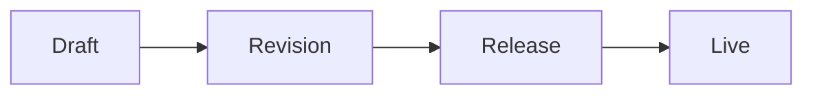

# Production verification — ContentKit Cockpit

> Set `CONTENTKIT_DEPLOY_URL` to the deployment under test before you start, e.g.
> `export CONTENTKIT_DEPLOY_URL=https://contentkit-api.example.com`. This file is
> tracked in the OSS repository and therefore names no deployment of its own.

Target: **$CONTENTKIT_DEPLOY_URL/cockpit/**
Run this **after** the v4.6.0 deploy, never before — every selector below only exists in the new bundle.

This is an executable checklist. Work top to bottom. Every step has **Do**, **Expect** and **Fail if**.
A step that fails does not stop the run: record it, mark the section red, continue. The only steps that
gate the rest are §1 and §2.

Someone who has never seen this console can execute this. Where a step needs judgement, the expected
outcome is written out literally.

---

## 0. Before you start

### 0.1 What you need

| Thing | Value |
|---|---|
| Console | `$CONTENTKIT_DEPLOY_URL/cockpit/` |
| API host | `$CONTENTKIT_DEPLOY_URL` (same process, same origin) |
| Browser | Chrome or Edge. The DOM snippets below use `document.styleSheets` and `getComputedStyle`, both same-origin. |
| Operator scopes | `site:admin`, `content:read`, `content:write`, `release:write`, `release:preview`, `access:admin`, `webhook:admin`, `moderation:write`, `api-key:admin`, `audit:read`, `deck:render` |
| Shell access (Appendix A only) | `ssh root@46.101.236.142`, unit `contentkit`, port 4050 |

The sidebar hides every entry whose scope the operator lacks. **A missing nav entry is not a bug** —
it means the signed-in grant does not carry that scope. If entries are missing, get a grant that carries
all of the above before reporting anything as broken.

### 0.2 Safety rule — do not verify on a live site

Everything except §23.9 runs against a **scratch site you create in §3**, slug `cockpit-verify`.
It has no hostname mapping, so nothing you do there can reach a visitor.

**Never run §3–§22 against `<your production site>`.** That site serves the site it publishes. In particular
`ck-site-delete-purge` on `<your production site>` would destroy the production website irrecoverably.

Before any destructive step, read the site slug out of the page:

```js
document.querySelector('[data-testid="ck-site-slug"]')?.textContent
```

If that is not `cockpit-verify`, stop.

### 0.3 Conventions

Paste this into the DevTools console once per page load. Every later snippet assumes it.

```js
window.$t  = (id) => document.querySelector(`[data-testid="${id}"]`)
window.$ta = (id) => [...document.querySelectorAll(`[data-testid="${id}"]`)]
window.$rows = (id, attr) => $ta(id).map((r) => r.getAttribute(attr))
```

Wherever the checklist says *"click `foo`"*, it means: click the element carrying
`data-testid="foo"`. Wherever it says *"row id"*, it means the value of the row's own
identity attribute (`data-item`, `data-release`, `data-user`, … — listed per section).

Keep the **Network** tab open with "Preserve log" ON for the whole run. Several checks are about
which requests fire, not only about what is on screen.

### 0.4 Version gate

1. `curl -s $CONTENTKIT_DEPLOY_URL/ready`
   **Expect** `200` and a version field reading `4.6.0` (or newer).
   **Fail if** the version is `4.3.3` or lower — the deploy did not land; stop and re-dispatch the deploy
   workflow. Everything below would fail for the wrong reason.
2. `curl -sI $CONTENTKIT_DEPLOY_URL/cockpit/ | head -3`
   **Expect** `200` and `content-type: text/html`.
   **Fail if** `503` with a body mentioning the console is not built — the binary shipped without
   `assets/cockpit`.

---

## 1. Sign-in

1. Open `$CONTENTKIT_DEPLOY_URL/cockpit/`.
   **Expect** either the console shell, or a page with a single button `sign-in`.
   **Fail if** a blank white page with a console error. That is a bundle/runtime failure — capture the
   error text; see Appendix A.9.
2. If `sign-in` is present, click it. You are redirected to the identity provider and back.
   **Expect** on return: `sidebar` exists, `operator-name` shows your subject, `operator-role` shows
   your role.
   **Fail if** you land back on `sign-in` in a loop → the session cookie is not being set;
   Appendix A.1.
3. `$t('session-splash')` should be gone once loaded.

**Gate:** do not continue until `$t('nav')` exists.

---

## 2. Shell, navigation and site switcher

1. `$ta('nav')[0].children.length` — count the nav entries.
   **Expect** 15 with the full scope set: `nav-overview`, `nav-sites`, `nav-content`, `nav-published`,
   `nav-compositions`, `nav-decks`, `nav-releases`, `nav-audio`, `nav-access`, `nav-webhooks`,
   `nav-moderation`, `nav-credentials`, `nav-audit`, `nav-assistant`, `nav-system`.
   **Fail if** an entry you hold the scope for is missing.
2. Click each nav entry once, top to bottom.
   **Expect** for every page: `$t('page')` exists and `$t('page-title')` has non-empty text; no
   uncaught error in the console; the URL keeps `?site=…` once a site is selected.
   **Fail if** any page renders an empty `page` body or throws. A crash here is the "guessed response
   shape" class of defect — record the exact error text and the page.
3. Click `site-switcher` and pick a site.
   **Expect** the URL gains/updates `?site=<slug>`, and the page's data reloads for that site.
   **Fail if** the selection resets on navigation, or `no-site` shows while a site is selected.
4. Click `account-menu-trigger`, then `account-theme-menu`.
   **Expect** the console flips light/dark. Remember this control — §21.7 uses it.

---

## 3. Sites

Page: `nav-sites`. Row identity: the settings editor is single-site; the current slug is
`ck-site-slug`.

### 3.1 Create

1. Click `site-new`.
   **Expect** dialog `ck-site-create` opens with three inputs: `site-new-name`, `site-new-base_url`,
   `site-new-default_locale` (pre-filled `en`).
2. Fill: name `Cockpit Verify`, base_url `https://cockpit-verify.invalid`, default_locale `en`.
   **Expect** `site-create-submit` becomes enabled only when all three are non-empty.
   **Fail if** submit is clickable with an empty field.
3. Click `site-create-submit`.
   **Expect** `POST /v1/sites` → `201`. Dialog closes. The switcher now selects the new site and
   `ck-site-slug` reads `cockpit-verify` (or `cockpit-verify-2`… if the slug was taken — note the
   actual slug and use it everywhere below).
   **Fail if** the dialog stays open with an error, or the switcher falls back to another site.
4. Click `site-create-cancel` on a second, fresh dialog.
   **Expect** dialog closes, no request fires.

### 3.2 View

1. **Expect** `ck-site-sections` renders nine section buttons:
   `ck-site-sections-identity`, `-presentation`, `-theme`, `-branding`, `-seo`, `-analytics`,
   `-audio`, `-reader`, `-unmanaged`.
2. Click each. **Expect** each shows its own fields; no section body is blank.
3. **The rule that matters:** search the whole page for a JSON blob.

```js
[...document.querySelectorAll('textarea')].filter(t => /^\s*[{[]/.test(t.value)).length
```

**Expect** `0`.
**Fail if** ≥ 1 — a raw-JSON editing surface is a hard violation; report it as a blocker.

4. Click `ck-site-sections-unmanaged`.
   **Expect** `ck-site-carried` lists settings keys the form does not own (may be empty on a new
   site — that is fine), read-only.

### 3.3 Edit

1. `ck-site-sections-presentation` → change `ck-site-description` to `verification run <today's date>`.
   **Expect** `ck-site-save-bar` appears; `ck-site-save-bar-state` says the form is dirty;
   `ck-site-save-bar-save` enables.
2. Click `ck-site-save-bar-reset`.
   **Expect** the field returns to its old value, the save bar's dirty state clears, **no request
   fires**.
3. Re-apply the change, then also set `ck-site-sections-reader` → `ck-site-feedback-enabled` to on
   (§15 needs it).
4. Click `ck-site-save-bar-save`.
   **Expect** in Network: a `GET /v1/sites/cockpit-verify` **immediately followed by** a
   `PATCH /v1/sites/cockpit-verify` → `200`. The re-read before the write is the lost-update guard;
   its absence is a defect.
   **Expect** on screen: a success toast in `ck-toasts`, save bar disappears.
   **Fail if** the PATCH body contains a `domains` key (open the request payload and check). The form
   cannot read the hostname list, so it must never write one; sending `domains` would delete every
   mapping on a real site.
5. Reload the page. **Expect** the description persisted.
6. **Identity confirmation:** `ck-site-sections-identity` → change `ck-site-base-url`, then save.
   **Expect** `ck-site-identity-confirm` opens first. Click `ck-site-identity-cancel` → nothing is
   written. Repeat and click `ck-site-identity-accept` → the PATCH fires.
   **Fail if** an identity field is written without the confirmation.
7. **Rejection lands on the control:** `ck-site-sections-theme` → put obviously invalid CSS into
   `ck-site-custom-css` (e.g. `@import url(http://evil.test/x.css);`) and save.
   **Expect** either a `422` whose message appears at `ck-site-custom-css-error` or in
   `ck-site-section-alert` *inside the theme section* — not a bare toast, not a blank screen.
   Undo the change afterwards.
8. **Conflict dialog (two browser windows):** open the same site in a second window. Change
   `ck-site-eyebrow` in window A and save. In window B (still holding the old copy) change
   `ck-site-description` and save.
   **Expect** window B shows `ck-site-conflict` listing the changed paths in `ck-site-conflict-list`
   / `ck-site-conflict-diff`, with `ck-site-conflict-reload` and `ck-site-conflict-overwrite`.
   **Expect** `ck-site-conflict-reload` discards B's edit and shows A's value.
   **Fail if** B's save silently overwrites A's without the dialog.

### 3.4 Delete — deferred

Site deletion is verified in **§25.2** (teardown), because the scratch site is needed by every section
below. Do not delete it now.

---

## 4. Content

Page: `nav-content`. Row testid `content-row`, row id in `data-item`.

### 4.1 View (list)

1. **Expect** a table of `content-row` elements (empty on a new site — the empty state is a valid
   view).
2. Set `content-kind-filter` to `post`, then `content-locale-filter` to `en`.
   **Expect** the list re-queries (`GET /v1/sites/cockpit-verify/content?...`) and narrows.
   **Fail if** filtering happens only client-side while the row count stays identical for a filter
   that should exclude rows.

### 4.2 Create

1. Click `content-new`.
   **Expect** the detail view opens: `content-tabs` with `content-tab-editor` active,
   `content-back` present.
2. In the editor, seven frontmatter groups are collapsible: `ck-fm-group-core`,
   `-publication`, `-layout`, `-media`, `-aids`, `-extra`, `-carried`. `core`, `publication` and
   `layout` are open by default.
3. Fill:
   - `ck-fm-title` → `Verification post`
   - `ck-fm-slug` → `verification-post`
   - `ck-fm-kind` → `post`
   - `ck-fm-locale` → `en`
   - `ck-fm-summary` → `A post created by the production verification run.`
   - `ck-fm-date` → today
4. Put this in `ck-content-body`:

   ```markdown
   ## Verification

   One paragraph of prose so the document has a body.
   ```

   **Expect** `ck-content-body-budget` shows a byte count against the 256 KiB budget.
5. **Structure pane:** click the `Structure` tab (`ck-content-preview-tabs`), panel
   `ck-content-tab-structure`.
   **Expect** `ck-structure-route` shows the route the document would publish to
   (e.g. `/en/blog/verification-post` — the exact shape depends on the site preset), and
   `ck-structure-outline` lists the `## Verification` heading. This pane is local — **no request**.
   **Fail if** a request fires for the structure tab.
6. **Rendered pane:** click `Rendered` (`ck-content-tab-rendered`). This is the same
   `POST /v1/sites/{site}/render` endpoint the assistant uses, debounced 400 ms, and it runs **only
   while this tab is open**.
   **Expect** `ck-preview-state` reads `Rendering…` then `Rendered`, and the document appears rendered.
   **Expect** in Network: typing continuously fires **one** request per pause, not one per keystroke.
   **Fail if** a request fires while a different tab is active — the pane must be disabled when hidden.
   **Fail if** a rejection produces a blank pane instead of `ck-preview-error` with the server's words.
   Diagnostics, when present, appear at `ck-preview-diagnostics`.
7. **Validate pane:** click `Validate` (`ck-content-tab-validate`), then `ck-validate-run`.
   **Expect** `ck-validate-verdict` states accepted or refused; a refusal shows the server's own words.
   For a `post` with no composition, `ck-validate-not-applicable` is the correct outcome — that is a
   pass, not a failure.
8. Click `ck-content-save-bar-save`.
   **Expect** `POST /v1/sites/cockpit-verify/content` → `201`. Then a
   `GET /v1/content/{id}/revisions`. A success toast. The URL/detail now has an item id.
   **Fail if** two POSTs fire, or the editor stays dirty after a 201.
9. Click `content-back`, then confirm one `content-row` exists with `data-item` set.
   Note that id — call it **`ITEM`** — you need it in §13, §15 and §23.

### 4.3 Edit

1. Reopen the item: click `content-open` on its row.
2. Change `ck-fm-summary`. **Expect** the save bar appears.
3. Navigate away (click `nav-releases`) **without saving**.
   **Expect** `ck-unsaved-guard` appears with `ck-unsaved-stay`, `ck-unsaved-discard`,
   `ck-unsaved-save`.
   **Fail if** the edit is silently lost.
4. Click `ck-unsaved-stay`, then `ck-content-save-bar-save`.
   **Expect** `PUT /v1/content/{ITEM}/revisions` → `201`, then a re-read of the revision list.
   **Expect** the revision count badge on the `revisions` tab increments to 2.
5. **Round-trip guard:** reload the page and reopen the item.
   **Expect** every field you set still holds its value and `ck-content-drift` is **absent**.
   **Fail if** `ck-content-drift` appears — the frontmatter emitter and parser disagree; capture the
   banner text, it names the drifting key.
6. **Directive palette:** open `ck-content-body-palette`.
   **Expect** 24 insert buttons, `ck-content-body-insert-hero` … `-insert-chart` … etc.
   Click `ck-content-body-insert-metric`.
   **Expect** a `:::metric{…}` block is inserted at the cursor and nothing else changes.

### 4.4 Delete

Two different operations. Both must be present and must not be confusable.

1. **Discard a draft** — on a row that has never been published, `content-discard` is offered.
   Click it. **Expect** `confirm-dialog` with the item title in bold and the words "cannot be undone".
   Click `confirm-cancel` → nothing happens.
   Click again, then `confirm-accept` → `DELETE /v1/content/{id}` → `200`, row disappears.
2. **Unpublish** — `content-unpublish` is offered **only** on a row with a published revision, and only
   with `release:write`. On the scratch site this appears after §23.4. Verify it there.
   **Fail if** both `content-discard` and `content-unpublish` are offered on the same row.
3. **Refusal path:** after §23.4 (item published), the `content-discard` button must be gone.
   If you can reach it, `DELETE /v1/content/{id}` answers `409 published content cannot be deleted`
   and the console must show that message, not a blank failure.

Recreate the item after any deletion — §5 onwards needs it.

---

## 5. Revisions

Detail view → `content-tab-revisions`. Row testid `ck-revisions-row`, id in `data-revision`.

1. **View:** **Expect** `ck-revisions` renders one `ck-revisions-row` per revision, newest first,
   each with its `data-revision` id, status and timestamp.
   **Fail if** the table is empty for an item that has revisions (`GET /v1/content/{ITEM}/revisions`
   returned rows).
2. **Diff:** click `ck-revisions-diff-{revisionId}` on the second-newest.
   **Expect** `ck-revisions-diff` opens and `ck-diff-list` shows added/removed lines for the summary
   you changed in §4.3.2.
   **Fail if** the diff is empty for two revisions whose bodies differ.
3. Click `ck-revisions-diff-close`. **Expect** the diff closes.
4. **Restore:** click `ck-revisions-open-{revisionId}` on an older revision.
   **Expect** the editor is populated with that revision's content and the save bar reports the form
   as dirty. **Nothing is written yet.**
   **Fail if** clicking it immediately writes a revision.
5. Save. **Expect** a **new** revision is appended (`PUT …/revisions` → `201`), the old ones are
   unchanged, the count grows.
   **Fail if** an existing revision's id or content changed — revisions are immutable.
6. **Create / edit / delete:** revisions have no create, edit or delete control of their own by design
   (create = save in the editor; edit and delete do not exist).
   **Fail if** the console offers a button that edits or deletes a revision.

---

## 6. Releases

Page: `nav-releases`. Row testid `release-row`, id in `data-release`.

### 6.1 View

1. **Expect** a table of `release-row`. Each row shows kind, status and a reason.
2. Click `release-expand-{id}` on any row.
   **Expect** `release-detail-{id}` opens showing the release's revisions resolved to titles where
   possible. Unmatched ids rendering as raw ids is **expected** (the overlay ids have no reverse
   lookup) — not a failure.
3. Click `release-refresh`. **Expect** `GET /v1/sites/cockpit-verify/releases` re-fires.

### 6.2 Create (build)

1. Type `verification run` into `release-reason`.
2. Click `release-build`.
   **Expect** `confirm-dialog` naming the site in bold and stating the live site changes.
3. `confirm-cancel` → no request. Then repeat and `confirm-accept`.
   **Expect** `POST /v1/sites/cockpit-verify/releases` → `201`. The button still reads `New release`
   while in flight — it grows a `ck-spinner` and goes `disabled`, and the label does not move, so the
   control the operator aimed at is still the control under the pointer. A new row appears; after the poll it reaches `active`.
   **Fail if** the list never updates (the page polls while a build is in flight) or the release
   settles on `failed` — capture the failure reason and see Appendix A.4.
4. **Important semantics:** a plain build carries **no** `revision_ids`. It rebuilds what is already
   published; a brand-new draft does **not** become live this way. §23 covers the publishing path.

### 6.3 Activate

1. `release-activate-{id}` is offered **only** on rows with `kind = release` and status `ready` or
   `superseded`.
   **Expect** it is absent on the `active` row and on every preview row.
   **Fail if** it is offered on a preview — clicking it would 404.
2. On a superseded release, click `release-activate-{id}` → `confirm-accept`.
   **Expect** `POST /v1/sites/{site}/releases/{id}/activate` → `200`; that row becomes `active` and
   the previously active one becomes `superseded`.
3. Re-activate the newest one to leave the site current.

### 6.4 Delete

1. `release-delete-{id}` is offered on every row whose status is neither `active` nor `building`.
   **Expect** it is **absent** on the active row.
   **Fail if** the active release offers a delete — the site is served out of it.
2. On a superseded release: click `release-delete-{id}` → `confirm-accept`.
   **Expect** `DELETE /v1/sites/{site}/releases/{id}` → `200`, row disappears.
3. **Refusal path:** if you can force a delete of the active release, the server answers `409` and the
   console must display that message.

### 6.5 Edit

Releases are immutable builds — there is no edit and must not be one.
**Fail if** any control mutates an existing release other than activate/delete.

---

## 7. Previews

Page: `nav-releases`, card at the top. Previews are releases of `kind = preview`; they are created in
this card and deleted in the release list below it.

### 7.1 Create

1. Click `ck-preview-new`. **Expect** dialog `ck-preview-dialog`.
2. Fill `ck-preview-slug` (or leave blank for a generated one), pick your item in
   `ck-preview-items`, set `ck-preview-expires` (e.g. 3600), `ck-preview-reason` `verification`.
   **Note:** selecting a document resolves its newest revision at submit — one extra request per
   selection is expected behaviour.
3. Click `ck-preview-submit`.
   **Expect** `POST /v1/sites/cockpit-verify/previews` → `201`, dialog closes, `ck-preview-links`
   appears with **two** distinct values: `ck-preview-url` and `ck-preview-invitation`.
   **Fail if** either renders `undefined` or the two are identical.
4. Click `ck-preview-url-copy` and `ck-preview-invitation-copy`.
   **Expect** each copies its own value (paste somewhere to confirm).
5. `ck-preview-cancel` on a fresh dialog → closes, no request.

### 7.2 View

1. Open the invitation URL in a **private window**.
   **Expect** it sets a preview cookie and serves the built page.
   **Fail if** it 404s — the preview build did not produce output; Appendix A.4.
2. Open the `ck-preview-url` **without** the invitation, in another private window.
   **Expect** it is refused (401/403/404). A preview reachable without the invitation is a
   confidentiality defect — report as a blocker.
3. Back in the console, the preview appears as a `release-row` with kind `preview`.

### 7.3 Edit

Previews are immutable and expire on their own. There is no edit.
**Fail if** one is offered.

### 7.4 Delete

1. Click `ck-preview-dismiss` — this only clears the links panel; **no request** must fire.
2. Find the preview's `release-row` and click `release-delete-{id}` → `confirm-accept`.
   **Expect** `DELETE …/releases/{id}` → `200`; the invitation URL now 404s in the private window.

---

## 8. Readers

Page: `nav-access`. Row testid `ck-reader-row`, id in `data-user`.

### 8.1 Create

1. Click `ck-reader-new` → `ck-reader-dialog`.
2. Fill `ck-reader-username` `verify-reader`, `ck-reader-display-name` `Verify Reader`,
   `ck-reader-password` (12+ chars), leave `ck-reader-active` on.
3. `ck-reader-submit`.
   **Expect** `POST /v1/sites/cockpit-verify/access/users` → `201`, and
   **`ck-reader-password-issued` appears exactly once** with the credential.
   **Fail if** it renders `undefined`/empty, or if it is still visible after a reload.
4. Reload. **Expect** `ck-reader-password-issued` is gone and cannot be recovered — that is correct.

### 8.2 View

**Expect** one `ck-reader-row` per reader with `data-user`, username, display name, active state, groups.

### 8.3 Edit

1. `ck-reader-edit-{id}` → change display name → `ck-reader-submit`.
   **Expect** a `PATCH`/`PUT` to the reader → `200`, row updates.
2. Reopen and change `ck-reader-password`.
   **Expect** `ck-reader-revoke-warning` states that every session of that reader ends.
   **Fail if** the warning is missing — the operator must know a password change signs the reader out.
3. Toggle `ck-reader-active` off → save. **Expect** the same warning and the row shows inactive.

### 8.4 Delete

1. `ck-reader-revoke-{id}` → `confirm-accept`. **Expect** sessions end, the reader stays listed as
   inactive.
2. `ck-reader-delete-{id}` → `confirm-accept`. **Expect** `DELETE` → `200`, row disappears.
   **Fail if** revoke and delete do the same thing — they are different operations.

Recreate a reader before §9.

---

## 9. Groups

Page: `nav-access`. Row testid `ck-group-row`, id in `data-group`.

### 9.1 Create

1. `ck-group-new` → `ck-group-dialog`. Fill `ck-group-slug` `verify-group`, `ck-group-name`
   `Verify Group`. `ck-group-submit`.
   **Expect** `201`, row appears.
2. Repeat with the same slug. **Expect** `ck-group-error` shows the server's duplicate message; the
   dialog stays open.

### 9.2 View / members

1. `ck-group-members-{id}` → `ck-group-members-dialog`, `ck-group-members` lists readers with the
   current members selected.
2. Add the reader from §8, `ck-group-members-submit`.
   **Expect** a `PUT` with the **full** member list (inspect the payload — a delta would be wrong,
   PUT replaces), `200`, the group's member count updates.
3. Reopen, deselect the reader.
   **Expect** `ck-group-members-removed` names who is about to lose the group **before** you submit.
   **Fail if** removal happens with no warning naming the reader.
4. `ck-group-members-cancel` → nothing written.

### 9.3 Edit

`ck-group-edit-{id}` → change `ck-group-name` → submit. **Expect** `200` and the row updates.

### 9.4 Delete, and the pre-empted 409

1. First create a rule that uses this group (§10.1), then return here.
   **Expect** the group row shows `ck-group-blocker-{ruleId}` buttons naming each blocking rule, and
   the confirm text reads "used by N rules" rather than offering a delete.
   **Fail if** the console offers a delete that then 409s — the blocker list exists precisely to
   pre-empt that.
2. Click a `ck-group-blocker-{ruleId}` button. **Expect** it opens that rule.
3. Delete the rule, return, then `ck-group-delete-{id}` → `confirm-accept`.
   **Expect** `DELETE` → `200`, row disappears.

---

## 10. Access rules, and the rebuild banner

Page: `nav-access`. Row testid `ck-rule-row`, id in `data-rule`.

### 10.1 Create

1. `ck-rule-new` → `ck-rule-dialog`.
2. Fill `ck-rule-path` `/en/blog/*`, `ck-rule-match` (prefix/exact/glob as offered), pick the group in
   `ck-rule-groups`, leave `ck-rule-users` empty. `ck-rule-submit`.
   **Expect** `201`, a `ck-rule-row` appears.
3. Submit a rule with **neither** users nor groups.
   **Expect** `ck-rule-audience-error` refuses it client-side.
   **Fail if** an audience-less rule is accepted.

### 10.2 View

**Expect** one `ck-rule-row` per rule showing path, match mode and its audience.

### 10.3 Edit — the both-keys rule

1. `ck-rule-edit-{id}`. Add a reader to `ck-rule-users`, submit.
2. **Inspect the PATCH payload.** **Expect** it carries **both** `users` and `groups`, even though only
   one changed.
   **Fail if** only the changed key is sent — PATCH merges per key, so an omitted key silently keeps
   the stored value and clearing an audience would appear to work while doing nothing.
3. Now clear the users list entirely and submit. **Expect** the row shows only the group afterwards.

### 10.4 The rebuild banner

1. After creating or editing a rule, **Expect** `ck-rebuild-banner` appears saying the rule protects
   nothing until the next build.
2. **Navigate to another page and back**, then **reload the whole browser tab**.
   **Expect** the banner is still there (it is persisted per site in `localStorage`).
   **Fail if** it disappears on reload — a draft rule that silently stops warning is the failure this
   persistence exists for.
3. Click `ck-rebuild-build` → `confirm-accept`.
   **Expect** a release build fires and the banner clears. Errors appear at `ck-rebuild-error`.
4. `ck-rebuild-dismiss` on a fresh banner → clears it without building.

### 10.5 Delete

`ck-rule-delete-{id}` → `confirm-accept`. **Expect** `DELETE` → `200`, row disappears, and a fresh
`ck-rebuild-banner` appears (the deletion also needs a build to take effect).

---

## 11. Webhooks

Page: `nav-webhooks`, tab `ck-webhook-tabs-endpoints` (panel `ck-webhook-tab-endpoints`). Row testid
`ck-webhook-row`, id in `data-endpoint`/row id attribute.

### 11.1 Create

1. `ck-webhook-new` → `ck-webhook-dialog`.
2. `ck-webhook-url` → `https://example.invalid/hook`, `ck-webhook-description` → `verification`,
   pick two events in `ck-webhook-events`, leave `ck-webhook-enabled` on. `ck-webhook-submit`.
   **Expect** `POST /v1/sites/cockpit-verify/webhooks` → `201`, and **`ck-webhook-secret-issued`
   shows the signing secret once**.
   **Fail if** it renders `undefined` or empty — that is exactly the class of bug this release fixed
   (`CreatedApiKey.api_key` vs `key`); report it.
3. Reload. **Expect** the secret is gone for good.

### 11.2 View

**Expect** each `ck-webhook-row` shows URL, description, events, and a state derived from
`disabled_at`.
**Fail if** every endpoint reads `paused` regardless of state — that was the `active` vs `disabled_at`
defect; if it reappears, report it.

### 11.3 Edit

1. `ck-webhook-edit-{id}` → change the event selection → submit.
   **Expect** `PATCH` → `200`, row reflects the new events.
2. Toggle `ck-webhook-enabled` off → submit. **Expect** the row shows disabled/paused, and enabling
   again restores it.
3. `ck-webhook-rotate-{id}` → `confirm-accept`.
   **Expect** `POST …/webhooks/{id}/rotate` → `200` and a **new** `ck-webhook-secret-issued` value,
   different from the first.
   **Fail if** the panel shows nothing or the same secret.

### 11.4 Delete

`ck-webhook-delete-{id}` → `confirm-accept`. **Expect** `DELETE` → `200`, row disappears.
Errors surface at `ck-webhook-error`.

---

## 12. Webhook deliveries

Same page, tab `ck-webhook-tabs-deliveries` (panel `ck-webhook-tab-deliveries`). Row testid
`ck-delivery-row`, id in the row.

Deliveries are **produced by the system**, not created by hand. Create / edit / delete do not exist and
must not be offered; the mutating operation is **retry**.

1. **Produce one:** with an endpoint pointing at `https://example.invalid/hook` and subscribed to
   content events, save a content revision and build a release (§6.2). Within a few seconds a delivery
   row appears (it will fail — the host does not resolve; that is the point).
2. **View:** **Expect** each `ck-delivery-row` shows the event **type**, endpoint, status and attempt
   count.
   **Fail if** the event column is blank — that was the `event` vs `type` defect.
3. Filter with `ck-delivery-endpoint-filter`, `ck-delivery-status-filter`, `ck-delivery-limit-filter`.
   **Expect** each re-queries `GET /v1/webhook-deliveries?…` server-side.
4. `ck-delivery-expand-{id}` → **Expect** `ck-delivery-detail-{id}` opens and shows the payload as a
   **definition list of fields**.
   **Fail if** the payload is dumped as `JSON.stringify` in a `<pre>`.
5. `ck-delivery-retry-{id}` → **Expect** `POST /v1/webhook-deliveries/{id}/retry` → `200`, attempt
   count increments.
   **Fail if** retry is offered on a delivery the worker currently holds and the resulting `409` is
   not shown to the operator.
6. **Auto-disable:** after repeated failures the endpoint disables itself. **Expect** the endpoint row
   flips to disabled on its own; see Appendix A.5 for the log line that confirms it.

---

## 13. Comments

Page: `nav-moderation`, tab `ck-moderation-tabs-comments` (panel `ck-moderation-tab-comments`). Row
testid `ck-comment-row`, id in `data-comment`.

Comments are **submitted by visitors**; the console moderates them. The create leg is therefore a
public POST.

### 13.1 Create (as a visitor)

The item must be `kind: post` and the site's `settings.comments.enabled` must not be `false` (it is on
by default).

```bash
curl -s -X POST $CONTENTKIT_DEPLOY_URL/public/v1/posts/ITEM/comments \
  -H 'content-type: application/json' \
  -d '{"site_id":"cockpit-verify","name":"Verifier","email":"verify@example.invalid","message":"A comment from the production verification run."}'
```

Replace `ITEM` with the id from §4.2.8.
**Expect** `201 {"accepted":true,"id":"…"}`.
**Fail if** `404 not found` → comments are disabled for the site or the item is not `kind: post`.
**Fail if** `422 captcha verification failed` → the deployment has Turnstile configured; that is a
configuration outcome, not a console defect. Get a token from a real site form, or skip to §14.

### 13.2 View

1. Reload `nav-moderation`. **Expect** a `ck-comment-row` with your text and status `pending`.
2. Set `ck-comment-status-filter` to `approved`. **Expect** the row disappears; set it back to
   `pending` and it returns. This filter must re-query the server.
3. **Expect** the comment resolves to its post's title via `ck-moderation-item-{id}`.
   Clicking it navigates to `/content` carrying the site — a known limitation until the content detail
   route exists; **not** a failure.

### 13.3 Edit (moderate)

1. Click `ck-comment-approve-{id}`.
   **Expect** `PATCH /v1/comments/{id}` → `200`, status becomes `approved`, and a republish is
   triggered so the live site shows it.
2. Click `ck-comment-reject-{id}` (or the inverse action offered on an approved row).
   **Expect** status flips back.
   **Fail if** the button label and the resulting status disagree.

### 13.4 Delete

`ck-comment-delete-{id}` → `confirm-accept`.
**Expect** `DELETE /v1/comments/{id}` → `200`, row disappears, and a republish is triggered.
Appendix A.6 covers the case where the republish fails after a successful delete.

---

## 14. Contact submissions

Same page, tab `ck-moderation-tabs-contact` (panel `ck-moderation-tab-contact`). Row testid
`ck-contact-row`, id in `data-submission`.

### 14.1 Create (as a visitor)

```bash
curl -s -X POST $CONTENTKIT_DEPLOY_URL/public/v1/contact \
  -H 'content-type: application/json' \
  -d '{"site_id":"cockpit-verify","name":"Verifier","email":"verify@example.invalid","message":"Contact request from the production verification run."}'
```

**Expect** `201 {"accepted":true,"id":"…"}`. Turnstile caveat as in §13.1.

### 14.2 View

1. **Expect** a `ck-contact-row` with status `new`.
2. Click `ck-contact-expand-{id}`.
   **Expect** `ck-contact-body-{id}` opens showing the **full message text** in the page.
   **Fail if** the full text is only available as a `title=` tooltip — that is unreachable by keyboard
   and was deliberately replaced.

### 14.3 Edit (triage)

Click `ck-contact-{status}-{id}` (e.g. handled/archived as offered).
**Expect** `PATCH /v1/contact-submissions/{id}` → `200`, the row's status changes and the status filter
now moves it.

### 14.4 Delete

`ck-contact-delete-{id}` → `confirm-accept`. **Expect** `DELETE` → `200`, row disappears.

---

## 15. Feedback

Same page, tab `ck-moderation-tabs-feedback` (panel `ck-moderation-tab-feedback`). Row testid
`ck-feedback-row`, id in `data-post` (feedback is aggregated **per post**, not per vote).

### 15.1 Create (as a visitor)

Requires `settings.feedback.enabled === true` — you set that in §3.3.3.

```bash
curl -s -X POST $CONTENTKIT_DEPLOY_URL/public/v1/posts/ITEM/feedback \
  -H 'content-type: application/json' -d '{"site_id":"cockpit-verify","vote":"up"}'
curl -s -X POST $CONTENTKIT_DEPLOY_URL/public/v1/posts/ITEM/feedback \
  -H 'content-type: application/json' -d '{"site_id":"cockpit-verify","vote":"down"}'
```

**Expect** `201` twice.
**Fail if** `404 not found` → `settings.feedback.enabled` is not `true`; go back to §3.3 and confirm
the save actually persisted that key.

### 15.2 View

1. **Expect** a `ck-feedback-row` for the post with up and down counts of 1 each.
2. `ck-feedback-post-filter` → narrow to that post. **Expect** it re-queries and the row stays.

### 15.3 Edit

Votes are anonymous and unmoderatable — there is no edit, by design.
**Fail if** the console offers one.

### 15.4 Delete (reset)

Click `ck-feedback-reset-{itemId}` → `confirm-accept`.
**Expect** `DELETE /v1/feedback/{id}` → `200` and the counts return to zero / the row disappears.

---

## 16. API keys

Page: `nav-credentials`, tab `ck-credentials-tabs-keys` (panel `ck-credentials-tab-keys`). Row testid
`ck-api-key-row`, id in the row.

### 16.1 Create

1. `ck-api-key-new` → `ck-api-key-dialog`.
2. `ck-api-key-name` → `verification key`; in `ck-api-key-scopes` select `content:read` only; in
   `ck-api-key-sites` select `cockpit-verify`; set `ck-api-key-expires` to a near date.
3. `ck-api-key-submit`.
   **Expect** `POST /v1/api-keys` → `201` and **`ck-api-key-issued` shows the raw key exactly once**,
   starting with the ContentKit key prefix.
   **Fail if** it renders `undefined` — the server returns the raw key in `key`, not `api_key`; this
   was broken before v4.6.0 and its return is a blocker.
4. Copy the key — call it **`PROBE_KEY`**. §23 uses it for the `curl` checks, so keep it until §25.
   Prove it works and is scoped:

   ```bash
   curl -s -o /dev/null -w '%{http_code}\n' -H "authorization: Bearer THEKEY" \
     $CONTENTKIT_DEPLOY_URL/v1/sites/cockpit-verify/content
   # expect 200
   curl -s -o /dev/null -w '%{http_code}\n' -X POST -H "authorization: Bearer THEKEY" \
     -H 'content-type: application/json' -d '{"reason":"nope"}' \
     $CONTENTKIT_DEPLOY_URL/v1/sites/cockpit-verify/releases
   # expect 403 insufficient_scope
   ```

   **Fail if** the second call succeeds — the scope selection did not reach the server.
5. Reload the console. **Expect** the raw key is unrecoverable.

### 16.2 View

**Expect** each `ck-api-key-row` shows name, scopes, site restriction, created/expires and a
fingerprint — never the key itself.
**Fail if** a full key value appears in any row.

### 16.3 Edit

API keys are not editable by design — rotation means create-new-then-revoke-old.
**Expect** no edit control on any row.
**Fail if** one exists.

### 16.4 Delete (revoke)

Do **not** revoke `PROBE_KEY` here — §23 needs it. Create a second, throwaway key first
(`ck-api-key-new`, name `verification throwaway`, scope `content:read`, site `cockpit-verify`) and copy
its value.

1. `ck-api-key-revoke-{id}` on the throwaway → `confirm-accept`.
   **Expect** `DELETE /v1/api-keys/{id}` → `200`, the row disappears.
2. Re-run the first curl from §16.1.4 with the **throwaway** key.
   **Expect** `401`.
   **Fail if** it still answers `200` — a revoked key is still being accepted; blocker.
3. Errors surface at `ck-api-key-error`.

`PROBE_KEY` is revoked in §25.1.

---

## 17. Identity grants

Page: `nav-credentials`, tab `ck-credentials-tabs-grants` (panel `ck-credentials-tab-grants`) — the tab
is offered only to a session holding `identity:admin`. Row testid `ck-grant-row`, id in the row.

### 17.1 Create

1. `ck-grant-new` → `ck-grant-dialog`.
2. `ck-grant-provider` — **Expect** a populated picker of providers (from `/v1/identity/providers`).
   **Fail if** it is empty or shows raw JSON — before v4.6.0 that response was typed `unknown` and the
   picker could not be built.
3. Fill `ck-grant-issuer`, `ck-grant-subject`, `ck-grant-email`, `ck-grant-display-name`,
   `ck-grant-role`, `ck-grant-scopes`, `ck-grant-sites` (restrict to `cockpit-verify`).
4. `ck-grant-submit`. **Expect** `POST /v1/identity-grants` → `201`, row appears.
5. **Duplicate:** submit the exact same issuer+subject again.
   **Expect** `409` surfaced at `ck-grant-conflict` — a named conflict, not a generic error.
   **Fail if** a second identical grant is created.

### 17.2 View

**Expect** each row shows provider, subject, role, scopes, site restriction and revocation state.
`ck-grant-authority` states where the ceiling comes from.

### 17.3 Edit

1. `ck-grant-edit-{id}` → narrow `ck-grant-scopes` → submit.
   **Expect** `PATCH /v1/identity-grants/{id}` → `200`, row updates.
2. Try to grant a scope **above** your own ceiling.
   **Expect** the server refuses and the message appears at `ck-grant-error`.
   **Fail if** privilege escalation succeeds — blocker, stop the run and report immediately.

### 17.4 Delete (revoke) and restore

1. `ck-grant-revoke-{id}` → `confirm-accept`. **Expect** `DELETE` → `200`; the row shows as revoked.
2. **Expect** `ck-grant-restore-{id}` is now offered, with `ck-grant-restore-note` explaining what
   restoring means. Click it. **Expect** the grant becomes active again.
3. **Do not revoke your own grant.** If you do, you lose the console.

---

## 18. Audio

Two surfaces: per item (`nav-content` → detail → `content-tab-audio`) and site-wide (`nav-audio`).

Audio requires `settings.audio.enabled` and a provider — set them in §3.3 via
`ck-site-sections-audio` (`ck-site-audio-enabled`, `ck-site-audio-provider`, `ck-site-audio-voice`,
`ck-site-audio-budget`). If the deployment has no TTS credentials, jobs will fail — record that as an
environment condition, not a console defect, and still verify the UI legs below.

### 18.1 Create

1. Open the published item (§23 must have run) → `content-tab-audio` → click `content-audio-create`.
   **Expect** `POST /v1/content/{ITEM}/audio` → `200/201`, and a `content-audio-job` row appears with
   `data-job` and status `queued`.
2. Site-wide: `nav-audio` → `audio-backfill` → `confirm-accept`.
   **Expect** `POST /v1/sites/{site}/audio/backfill` → `200`. Set `audio-limit-chars` first to bound
   the spend.
   **Fail if** the confirm dialog does not state what is about to be spent.

### 18.2 View

1. `nav-audio` → **Expect** `audio-summary` renders the budget line.
   **Fail if** it is blank — that was the `budget` vs `summary` field defect.
2. **Expect** `audio-job-row` rows with `data-job`, status, characters and error text where present.
3. `audio-status-filter` and `audio-limit-filter` → **Expect** each re-queries server-side.

### 18.3 Edit (retry)

`audio-retry-{jobId}` on a failed job → `confirm-accept`.
**Expect** `POST /v1/sites/{site}/audio/jobs/{job}/retry` → `200`, status returns to `queued`.
**Expect** a job the worker currently holds answers `409` and the console shows that message.

### 18.4 Delete

`content-audio-remove` on the item → `confirm-accept`.
**Expect** `DELETE /v1/content/{ITEM}/audio` → `200`, jobs and assets are removed, the tab shows no
audio.

---

## 19. Decks

Page: `nav-decks`. Requires `deck:render`.

### 19.1 Create / view

1. Paste a minimal deck into `deck-source` (frontmatter with `kind: deck` plus a couple of slides).
2. Click `deck-validate`.
   **Expect** either `deck-diagnostics` listing findings, or `deck-diagnostics-clean`.
   A refusal shows at `deck-validate-error` in the server's own words.
   **Fail if** a 422 produces a blank pane.
3. Click `deck-render`.
   **Expect** `deck-job` appears with a job id and a status that progresses; on success
   `deck-job-download` is offered.
   **Known limitation:** the job result is offered as a JSON **download** rather than rendered,
   because `deckJobResult` has no response schema yet. That is expected in v4.6.0 — not a failure.
4. **Expect** `deck-theme-{name}` and `deck-template-{id}` registries render as pickable lists from
   `/v1/deck-themes` and `/v1/deck-templates`.
   **Fail if** either list is empty.

### 19.2 Edit / delete

A deck is a content item of `kind: deck`. Edit and delete it through §4 (the content editor and its
discard/unpublish), not here. This page is validate-and-render only.
**Fail if** this page offers a destructive control.

---

## 20. Compositions

Page: `nav-compositions`. Requires `content:write` (the three actions all write-gate).

1. Paste a report document into `composition-source` — the one from §21.2 works.
2. `composition-recommend` → **Expect** pattern recommendations render.
3. `composition-validate` → **Expect** an accepted/refused verdict; a refusal shows the server's words
   at `composition-error-{label}`.
4. `composition-compile` → **Expect** `composition-result` renders the compiled output and
   `composition-diagnostics` lists any findings.
   **Fail if** any of the three produces a blank pane on a 422 rather than the message.
5. **Registries:** `pattern-row` (id in `data-pattern`) and `guide-row` (id in `data-guide`) list the
   pattern and publishing-guide registries. Click `pattern-open-{id}` → `pattern-dialog` opens;
   `guide-open-{id}` → `guide-dialog` opens.
   **Expect** `pattern-filter-canvas` and the other `pattern-filter-{key}` controls narrow the list.
6. **Create / edit / delete:** compositions are authored as content, not as objects here. This page is
   a compiler and a catalogue.
   **Fail if** it offers a create or delete.

---

## 21. The assistant: `:::metric`, `:::chart`, a mermaid fence, and exactly one render

This is the single most important section. It proves the console renders authored semantics through
**ContentKit's own pipeline**, once per message, and never in the browser.

### 21.1 Setup

1. `nav-assistant`, with `cockpit-verify` selected.
2. Open DevTools → **Network**, filter the request URL on `render`. Clear the log.
3. Click `assistant-new` to start a clean conversation.

### 21.2 Ask for a reply containing all three constructs

Paste the text below into `assistant-input` and send with `assistant-send`. It is deliberately
prescriptive — this step verifies the render pipeline, not the model's judgement.

`````text
Reply with exactly the following Markdown and no commentary before or after it.

## Verification fragment

:::metric{label="Successful builds" value="99.98%" period="Last 30 days" target="99.9%" status="above target" role="primary"}
:::

:::chart{type="bar" title="Revenue versus plan" description="Monthly revenue and plan in thousands of euros" unit="€k"}
| Month | Revenue | Plan |
|---|---:|---:|
| Apr | 438 | 425 |
| May | 471 | 450 |
| Jun | 512 | 480 |
:::


`````

If the assistant paraphrases instead of reproducing it, send it again with "reproduce it verbatim".
The three constructs must all be present in the finished message or §21.4–§21.5 measure nothing.

### 21.3 While the message is streaming

**Expect** the reply is shown as a typographic draft — plain React elements. In the draft you may see
`draft-placeholder`, `draft-link-inert`, `draft-image-inert`.
**Expect** `assistant-stop` replaces `assistant-send`.
**Expect** in Network: **zero** requests to `/render` while streaming.
**Fail if** a `/render` request fires per token or per chunk — that is the whole reason rendering is
deferred; report it as a blocker.

### 21.4 The one-render assertion

When the message finishes:

1. In Network, count requests matching `POST /v1/sites/cockpit-verify/render`.
   **Expect exactly 1.** Status `200`.
   **Fail if** 0 → the fragment never rendered; the draft stays and `assistant-render-problem` should
   explain why. **Fail if** ≥ 2 → the render query key is unstable (it is
   `['render', site, messagePartId, scheme]`); report the count and the request bodies.
2. Refine: one POST fires per assistant **text part**. A plain prose reply is one part. If the model
   emitted tool calls interleaved with two separate text parts, 2 is correct — confirm by counting
   `assistant-message [data-role="assistant"]` text blocks. State the count you observed either way.
3. Inspect the request payload. **Expect** `{ markdown: "…", scheme: "light" | "dark" }` — never
   `auto` from this console, and **no** `source` echoed back in the response.
4. Inspect the response. **Expect** `html`, `semantic`, `narrative`, `composition`, `diagnostics`,
   `accessible_text`, `has_mermaid: true`, `chart_count: 1`, and a strong `etag` header.
   **Fail if** `chart_count` is 0 or `has_mermaid` is false — the fragment did not carry what you
   asked for; re-send before blaming the renderer.

### 21.5 What must be on screen

```js
const host = $t('assistant-rendered')
;({
  metric:  host.querySelectorAll('.report-metric').length,
  chart:   host.querySelectorAll('img.report-chart-image, picture.report-chart-picture').length,
  caption: host.querySelectorAll('.report-chart-caption').length,
  data:    host.querySelectorAll('details.report-chart-data table').length,
  mermaid: host.querySelectorAll('pre.mermaid[data-processed]').length,
  svg:     host.querySelectorAll('pre.mermaid svg').length,
  declined:host.querySelectorAll('pre.mermaid.ck-diagram-declined').length,
})
```

**Expect** `metric ≥ 1`, `chart === 1`, `caption === 1`, `data === 1`, `mermaid === 1`,
`svg === 1`, `declined === 0`.

- **Fail if** `chart === 0` → the chart was not rasterised server-side. The chart is a server-rendered
  ``/`<picture>`; a `<canvas>` or an inline ECharts container in the DOM means a second renderer
  crept into the browser — blocker.
- **Fail if** `svg === 0` and `declined === 1` → Mermaid declined the diagram. `flowchart` is on the
  runnable list, so a decline here means the Mermaid chunk failed to load; check the console for a CSP
  or chunk-load error and see Appendix A.9.
- **Fail if** `svg === 0` and `declined === 0` → Mermaid claimed the node and never drew it.
- **Fail if** `mermaid === 2` for one fence → the double-render guard
  (`data-ck-enhanced` / `data-processed`) regressed.

Also assert the diagram was not given HTML labels:

```js
$t('assistant-rendered').querySelectorAll('pre.mermaid foreignObject').length  // expect 0
```

### 21.6 The reload assertion (cache)

1. Reload the browser tab and return to `nav-assistant`.
   **Expect** the conversation is restored and the rendered HTML reappears **with zero new
   `/render` requests** — it is cached in IndexedDB `contentkit-cockpit` → store `renders`.
   **Fail if** a fresh POST fires for a message that has not changed.

### 21.7 The theme assertion

1. Click `account-menu-trigger`, then `account-theme-menu`.
   **Expect** exactly **one additional** `POST …/render` for that message, with the other `scheme`.
   This is by design: report charts are rasterised server-side and no stylesheet can recolour an SVG
   that is already drawn.
   **Fail if** zero (the chart stays in the wrong scheme) or more than one.
2. Toggle back. **Expect** zero new requests — that scheme is already cached.

### 21.8 The refusal path

Send this — an unknown attribute on a known directive is a guaranteed refusal:

`````text
Reply with exactly the following two lines and nothing else.

:::metric{label="Broken" value="1" bogusAttribute="x"}
:::
`````

**Expect** the POST answers `422` with the message
`metric directive has unknown attribute "bogusAttribute"`.
**Expect** the draft stays on screen and `assistant-render-problem` shows that text **verbatim** — it
is the same refusal a release would raise, and reading it is the point.
**Fail if** the message is generic ("Rendering failed" with nothing under it) — the server's words were
swallowed.
**Expect** the request is **not retried** (count stays at 1).
**Expect** the rest of the conversation still renders.
**Fail if** the message disappears, the whole page errors, or the request is retried in a loop.

### 21.9 Elicitation

If the assistant proposes a mutation, an `elicitation-card` appears with `elicitation-approve` and
`elicitation-decline`.
**Expect** declining changes nothing; approving performs exactly the named action.
**Fail if** a mutation happens without a card.

---

## 22. Style-leak check

The console renders ContentKit's published stylesheet, scoped to `.ck-content` at build time. If the
scoping regressed, the site's `:root` tokens, its `*` reset and its `html`/`body` rules would repaint
the whole console.

### 22.1 Take a baseline on a page with no content surface

Go to `nav-releases` (no rendered content) and run:

```js
window.__probe = () => {
  const pick = (el, props) =>
    props.map((p) => `${p}=${getComputedStyle(el).getPropertyValue(p)}`).join('|')
  return [
    pick(document.body, ['font-family','text-rendering','line-height','background-color','color','margin-top']),
    pick(document.documentElement, ['scroll-behavior','--background','--foreground','--radius']),
    pick($t('sidebar'), ['font-family','background-color','color','border-right-color','width']),
    pick($t('nav-releases'), ['font-family','font-size','color','border-radius','padding-left','box-sizing','border-color']),
    pick(document.querySelector('button'), ['font-family','font-size','background-color','color','border-radius','box-sizing','border-color']),
  ].join('\n')
}
window.__before = __probe()
```

### 22.2 Open a page with rendered content, then re-probe

Go to `nav-assistant` (the §21 conversation is restored and rendered), or `nav-content` → item →
`content-tab-live`. Confirm `$t('assistant-rendered')` or `$t('content-live-html')` exists, then:

```js
__probe() === __before          // ASSERTION 1 — must be true
```

**Fail if** `false`. Diff the two strings; the differing property names which rule leaked.

### 22.3 The three named assertions

```js
// ASSERTION 2 — site.css's `body { text-rendering: optimizeLegibility }` was dropped by the scoper.
getComputedStyle(document.body).getPropertyValue('text-rendering')          // === 'auto'

// ASSERTION 3 — site.css's `html { scroll-behavior: smooth }` was dropped by the scoper.
getComputedStyle(document.documentElement).getPropertyValue('scroll-behavior') // === 'auto'

// ASSERTION 4 — every published-stylesheet rule that reached the console carries the scope.
;(function () {
  const flat = (list, out = []) => {
    for (const r of list) { if (r.cssRules) flat(r.cssRules, out); else out.push(r) }
    return out
  }
  const rules = [...document.styleSheets].flatMap((s) => { try { return flat(s.cssRules) } catch { return [] } })
  return rules
    .filter((r) => r.selectorText)
    .filter((r) => /report-(metric|chart|tone|grid|card|feature)/.test(r.selectorText))
    .filter((r) => !r.selectorText.includes('.ck-content'))
    .map((r) => r.selectorText)
})()                                                                         // === []
```

**Expect** assertion 2 = `'auto'`, assertion 3 = `'auto'`, assertion 4 = `[]`.

- **Fail if** assertion 2 returns `optimizelegibility` → site.css's `body` rule leaked; the scoper's
  `DROPPED` set regressed.
- **Fail if** assertion 3 returns `smooth` → the `html` rule leaked.
- **Fail if** assertion 4 returns any selector → the published sheet is applying outside its container;
  every listed selector is a leak. This is the assertion that catches a token leak too, because
  `:root` is rewritten to `.ck-content` by the same code path.

### 22.4 Containment

```js
$t('sidebar').closest('.ck-content')      // === null
$t('nav').closest('.ck-content')          // === null
document.querySelectorAll('.ck-content').length  // ≥ 1 on a content page
```

**Fail if** any console chrome is inside a `.ck-content` container.

### 22.5 Visual confirmation

Screenshot the sidebar on `nav-releases` and on `nav-assistant` (with content rendered). Compare.
**Expect** pixel-identical chrome: same font, same weights, same spacing, same button radii.
**Fail if** the sidebar font, colour or spacing shifts when content is on screen — that is the leak the
assertions above are meant to catch numerically; if the screenshots differ but every assertion passed,
report both, because the assertion set is then incomplete.

---

## 23. The deploy chain, end to end

Proves: content created in the console reaches a release, activation makes it the served output, and
the site actually serves it.

**Read this first.** A plain "New release" (§6.2) sends **no** `revision_ids` — it rebuilds what is
already published and will **not** publish a new draft. From the console, the only path that publishes
new content is a **scheduled** revision plus `publish-due`. Follow the steps exactly.

### 23.1 Create the content

`nav-content` → `content-new` → fill as in §4.2, but additionally set
**`ck-fm-scheduled-at` to a timestamp in the past** (e.g. yesterday). Save.

**Expect** `POST /v1/sites/cockpit-verify/content` → `201`.
**Expect** the row's status reads `scheduled`, not `draft`.
**Fail if** it reads `draft` — the `scheduledAt` value did not reach the server; open the request
payload and check the emitted frontmatter carries `scheduledAt`.

### 23.2 Confirm it is not live yet

Open the item → `content-tab-live`.
**Expect** an error or empty state: there is no published output yet. That is correct.

```bash
curl -s -o /dev/null -w '%{http_code}\n' -H "authorization: Bearer PROBE_KEY" \
  $CONTENTKIT_DEPLOY_URL/v1/sites/cockpit-verify/published/post/en/verification-post
# expect 404
```

### 23.3 Publish the due revision

`nav-system` → click `maintenance-publish-due` → `confirm-accept`.

**Expect** `POST /v1/publish-due` → `200` with a `published` array containing a result for
`cockpit-verify`.
**Fail if** the array carries an `error` for the site — capture it and see Appendix A.4.

### 23.4 Confirm the release

`nav-releases` → `release-refresh`.
**Expect** a new `release-row`, `kind = release`, reason `scheduled publish`, status `active`, and the
previously active release now `superseded`.
**Expect** `release-expand-{id}` lists your revision.

### 23.5 Build another release explicitly

Type `verification chain` into `release-reason` → `release-build` → `confirm-accept`.
**Expect** `201`, a second release reaches `active`, the first becomes `superseded`.
This is the step that is forgotten in practice: a template or CSS change is only rendered into HTML at
**release** time, never at request time.

### 23.6 Activate an older one (rollback), then roll forward

1. `release-activate-{supersededId}` → `confirm-accept`.
   **Expect** `200`; that release becomes `active`.
2. `release-activate-{newestId}` → `confirm-accept`. **Expect** it becomes `active` again.
   **Fail if** either activation takes more than a moment or leaves two rows `active` — activation is a
   single atomic pointer swap.

### 23.7 Confirm the served output — in the console

Open the item → `content-tab-live`.
**Expect** `content-live-html` renders the document as the **active release** built it, including the
`## Verification` heading.
**Fail if** the pane is empty while §23.4 reported a successful build — that is the "site serves empty
pages after a re-render" failure mode; go straight to Appendix A.7.

### 23.8 Confirm the served output — over HTTP

```bash
curl -s -H "authorization: Bearer PROBE_KEY" \
  $CONTENTKIT_DEPLOY_URL/v1/sites/cockpit-verify/published/post/en/verification-post \
  | head -c 400
```

**Expect** `200` with an `html` field containing your heading.
**Fail if** `404` after a successful activation, or `200` with an empty/whitespace `html`.

Also confirm the release object itself is being served — request the same document with an
`if-none-match` matching the previous `etag`:

**Expect** `304`.
**Fail if** the ETag never matches — caching is not working and every request re-renders.

### 23.9 The real site (optional, production-affecting)

Only if the change under test must be confirmed on **the site it publishes**, and only with explicit
intent. Switch the console's site to `<your production site>`, build a release with a reason naming this run, and
then:

```bash
curl -s https://the site it publishes/de/ | head -c 400
curl -sI https://the site it publishes/de/ | grep -i '^etag\|^last-modified'
```

**Expect** `200` German HTML reflecting the new build.
**Always `curl`; never a caching fetcher** — a cached copy has previously misrepresented the live
state. `/en/` is a legitimate `404`; the site is German-only.

Also confirm the host split still holds:

```bash
curl -s $CONTENTKIT_DEPLOY_URL/llms.txt | head -3   # ContentKit's own docs
curl -s https://the site it publishes/llms.txt        | head -3       # the site's own file
```

**Fail if** both return the same body — a site domain row is covering the API host, which would serve
the whole website under the management hostname.

---

## 24. Audit trail

Page: `nav-audit`. Row testid `ck-audit-row`, id in `data-event`.

**Scope note, so you do not chase a phantom:** only **five** actions are recorded today —
`site.delete`, `content.delete_draft`, `api_key.create`, `api_key.revoke`, `identity.create`.
Content creation, releases, webhook and reader changes are **not** in the audit log. Do not fail this
section for their absence; if broader coverage is expected, that is a product gap to report, not a
console defect.

1. **View:** **Expect** `ck-audit-row` rows with action, actor, resource, result and timestamp.
2. `ck-audit-site-filter` → `cockpit-verify`; `ck-audit-action-filter` → `api_key.create`;
   `ck-audit-limit-filter` → 25.
   **Expect** each re-queries `GET /v1/audit-events?site=…&action=…&limit=…` **server-side** (check
   the request URL carries the parameters).
   **Fail if** the parameters are missing from the request — filtering client-side over a truncated
   page silently hides events.
3. **Expect** the `api_key.create` from §16.1 and the `api_key.revoke` from §16.4 are both listed.
4. Within the matching `ck-audit-row`, click `ck-audit-expand` → **Expect** `ck-audit-detail` shows
   safe metadata and human-readable actor, resource and site labels as a definition list.
   **Fail if** it is a `JSON.stringify` dump.
5. **Create / edit / delete:** the audit log is append-only and has none.
   **Fail if** the console offers any mutation here — blocker.

---

## 25. Teardown

Do these in order.

1. Revoke `PROBE_KEY` (§16) and any other key you created; revoke the identity grant from §17 (never
   your own); delete the webhook endpoint, rules, groups and readers you created.
   **Expect** the §23.8 curl now answers `401`.
2. **Delete the scratch site — the two-step:**
   1. Confirm `$t('ck-site-slug').textContent` reads `cockpit-verify`. **If it does not, stop.**
   2. `nav-sites` → `ck-site-delete` → dialog `ck-site-delete-dialog`.
   3. Click `ck-site-delete-confirm` (first answer, **no** purge).
      **Expect** `DELETE /v1/sites/cockpit-verify?purge=false` → `409`, and `ck-site-delete-refusal`
      shows the server's message naming what would go (content, releases, readers).
      **Fail if** the first request carries `purge=true`, or the first click deletes the site outright
      — the refusal *is* the confirmation step and the console must never pre-set `purge`.
   4. The button's testid is now `ck-site-delete-purge` and its label changed. Click it.
      **Expect** `DELETE /v1/sites/cockpit-verify?purge=true` → `200`, a success toast, the site
      disappears and the switcher falls back to another site.
   5. `ck-site-delete-cancel` at any point → nothing is written.
3. Clear the local render cache so a later session starts clean:

```js
indexedDB.deleteDatabase('contentkit-cockpit')
```

4. Open `account-menu-trigger` and sign out with `account-sign-out`. **Expect** you land back on `sign-in`.

---

## Appendix A — production logs, per failure mode

Access:

```bash
ssh root@46.101.236.142
journalctl -u contentkit -o cat -f            # follow
journalctl -u contentkit -o cat --since '30 min ago' > /tmp/ck.log
```

Every line is one JSON object. Useful shapes:

```bash
# every request, route-templated
jq -c 'select(.msg=="request")' /tmp/ck.log

# non-2xx only
jq -c 'select(.msg=="request" and .status >= 400) | {ts,path,method,status,ms,request_id}' /tmp/ck.log

# one request end to end (take x-request-id from the browser's response headers)
jq -c 'select(.request_id=="ab12cd34ef56")' /tmp/ck.log
```

Prometheus counters are unauthenticated but reachable only over the loopback (Caddy answers 404 for
`/metrics` even on the API host):

```bash
curl -s http://127.0.0.1:4050/metrics | grep -E 'contentkit_(requests_total|builds_total|builds_inflight|deck_builds)'
```

| # | Failure mode | What to look for |
|---|---|---|
| A.1 | **Sign-in loops** (§1) | `jq -c 'select(.path=="/v1/identity/session" or .path=="/v1/identity/cockpit-login")'` — a `401` on `/v1/identity/session` right after a `200` on the login means the cookie is not being kept. Check `CONTENTKIT_PUBLIC_URL` matches the browsed host exactly; `isApiHost()` compares hostnames literally. |
| A.2 | **A console write 403s** (§3, §8–§17) | `jq -c 'select(.msg=="insufficient scope")'` → fields `scope`, `siteId`, `key` (fingerprint). The scope named is the one the grant lacks. A `401` instead appears as `{"msg":"unauthorized"}`. |
| A.3 | **A console write is rejected with no useful message** | `jq -c 'select(.msg=="operator csrf rejected")'` — the session's CSRF token was missing or stale. Usually a very old tab; reload and retry before reporting. |
| A.4 | **Release or preview build fails / stalls** (§6.2, §7.1, §23.3) | `jq -c 'select(.msg=="scheduled publish failed")'` for the publish-due path. `jq -c 'select(.msg=="request" and (.path\|test("/releases")))'` for status and `ms`. Watch `contentkit_builds_inflight` in `/metrics` — permanently ≥ 1 means a build never finished. `jq -c 'select(.msg=="async deck build failed")'` for deck jobs. |
| A.5 | **Webhook deliveries never succeed / endpoint disables itself** (§12) | `jq -c 'select(.msg=="webhook delivery failed")'` → endpoint id, status, attempt. `jq -c 'select(.msg=="webhook endpoint auto-disabled")'` → the endpoint gave up after N failures. `jq -c 'select(.msg=="webhook poll failed")'` means the whole dispatcher is failing, not one endpoint. A `401` from the receiver is a shared-secret mismatch, not a ContentKit fault. |
| A.6 | **Moderation succeeds but the live site does not change** (§13.3, §13.4) | `jq -c 'select(.msg=="comment approval republish failed" or .msg=="comment deletion republish failed")'` → the moderation write committed and the republish did not. The comment is correct in the database and stale on the site; a manual release build (§6.2) repairs it. |
| A.7 | **Pages serve empty after a release** (§23.7, §23.8) | This has happened before and was a storage/disk problem, not a renderer one. In order: `df -h /` on the droplet (95 % full has caused it); then `jq -c 'select(.msg=="request" and .path=="/:published-path" and .status==200)'` and compare the response sizes; then `jq -c 'select(.msg=="storage ready" or .msg=="request failed")'` around the build's timestamp. Also try `POST /v1/maintenance/storage-gc` from `nav-system` → `maintenance-storage-gc`. |
| A.8 | **Audio jobs fail or never start** (§18) | `jq -c 'select(.msg=="audio job failed")'` → `jobId`, `attempts`, `terminal`, `error`. `jq -c 'select(.msg=="audio budget exhausted")'` means the site's configured budget stopped it — a settings outcome, not a defect. `jq -c 'select(.msg=="audio poll failed")'` means the worker itself is down. `audio jobs enqueued` confirms the enqueue side worked. |
| A.9 | **Blank console / chunk fails to load / Mermaid declines** (§1, §21.5) | Nothing server-side will show this; it is a browser-side failure. Capture the DevTools console error and the failing request from the Network tab. A `Content Security Policy` violation mentioning `unsafe-eval` on a diagram is **expected** for diagram kinds outside the runnable set (`flowchart`, `graph`, `sequenceDiagram`, `stateDiagram`, `erDiagram`, `classDiagram`) — those are declined on purpose. A CSP violation on the *bundle* is a deploy problem. Confirm the asset is being served: `curl -sI $CONTENTKIT_DEPLOY_URL/cockpit/assets/<name>.js`. |
| A.10 | **Renders are slow or fire too often** (§21.4) | `jq -c 'select(.msg=="request" and .path=="/v1/sites/:site/render") \| {ts,status,ms,request_id}'`. The count in a one-minute window should match the number of finished assistant messages. Repeated `200`s with identical `ms` for the same content mean the LRU (256 entries, keyed on markdown+scheme+theme+version) is being missed — most likely the client is varying the payload. A `413` means the fragment exceeded 256 KiB; a `422` is a genuine refusal and belongs on screen. |
| A.11 | **The whole surface 404s on the wrong host** (§23.9) | `jq -c 'select(.msg=="request" and .status==404)' \| head` and compare `path` against what you requested. `/llms.txt`, `/openapi.json` and `/metrics` exist **only** on the API host by design. If site paths are answering on the API hostname, a `ck_site_domains` row is covering it — that is a serious misconfiguration; do not resolve it from the console. |
| A.12 | **A page crashed with a shape error** (§2.2) | The server is fine; the console guessed a response shape. Capture the exact browser error and the operation, and check the response body against `docs/openapi.json`. Every response the console reads must be derived from the spec — a mismatch is a code defect, and the fix belongs in `src/openapi.mjs` first. |

---

## Appendix B — result template

Copy this into the run report.

```
ContentKit Cockpit — production verification
Date:            
Version (/ready):
Operator:        
Scratch site:    cockpit-verify

  §1  Sign-in                      pass / fail
  §2  Shell and navigation         pass / fail
  §3  Sites (create/view/edit)     pass / fail
  §4  Content                      pass / fail
  §5  Revisions                    pass / fail
  §6  Releases                     pass / fail
  §7  Previews                     pass / fail
  §8  Readers                      pass / fail
  §9  Groups                       pass / fail
  §10 Rules + rebuild banner       pass / fail
  §11 Webhooks                     pass / fail
  §12 Deliveries                   pass / fail
  §13 Comments                     pass / fail
  §14 Contact submissions          pass / fail
  §15 Feedback                     pass / fail
  §16 API keys                     pass / fail
  §17 Identity grants              pass / fail
  §18 Audio                        pass / fail / n-a (no TTS credentials)
  §19 Decks                        pass / fail
  §20 Compositions                 pass / fail
  §21 Assistant render             pass / fail   renders observed: ___ (expected 1)
  §22 Style leak                   pass / fail   assertions 1-4: ___
  §23 Deploy chain                 pass / fail
  §24 Audit                        pass / fail
  §25 Teardown                     pass / fail   scratch site deleted: yes / no

Blockers:
Defects:
Environment conditions (not defects):
```

**Do not close the run with the scratch site still present.** If §25.2 could not complete, say so
explicitly and name the site that is still there.
